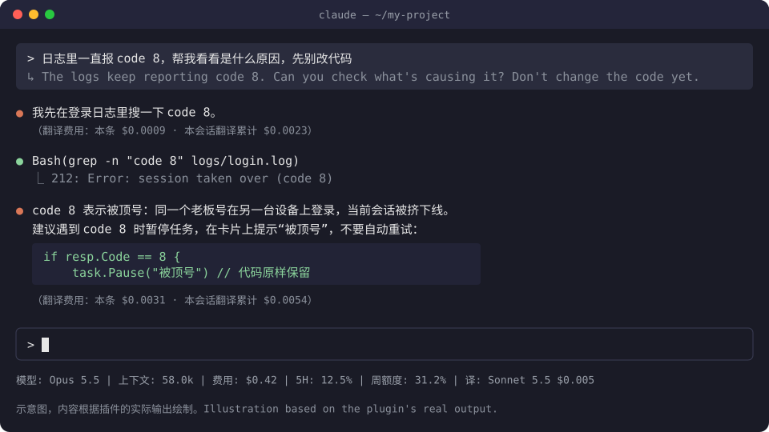
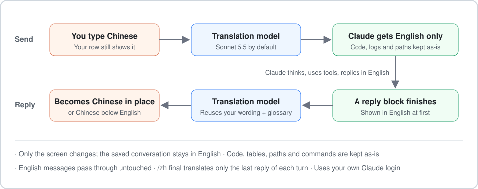
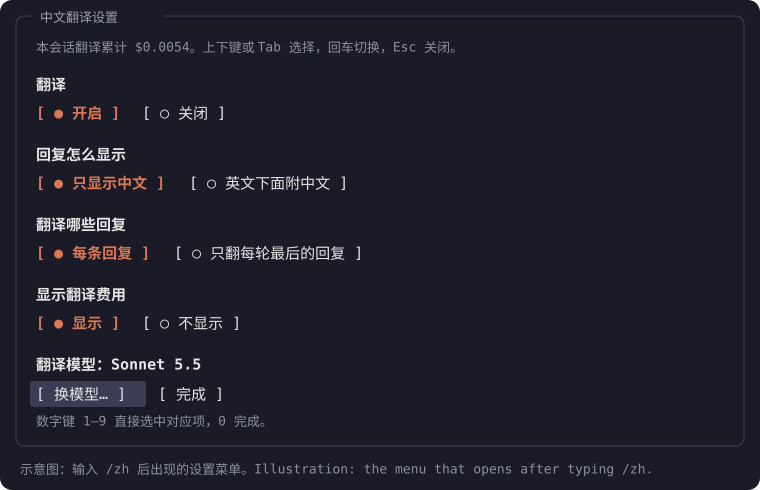

<div align="center">

# Claude Code Chinese Translation

[简体中文](README.md) · **English**

Use Chinese in the native `claude` CLI. Your Chinese reaches Claude only as English, and replies turn into Chinese right where they appear.



</div>

## Features

- **English only to Claude.** A translation model turns your Chinese into English, and only the English is sent. Your row still shows what you typed, and the line starting with ↳ underneath shows exactly what was sent.
- **Chinese replies.** Claude replies in English. Each block is translated in the background as soon as it's finished, then shown in Chinese in place. You can also keep the English with the Chinese below it.
- **Question dialogs too.** When Claude asks you something in a question dialog, the question and options show in Chinese; the options you pick and anything you type reach Claude in English. The dialog waits a few seconds for the translation before it opens.
- **Untouched content.** Code blocks, tables, paths and commands are kept as-is.
- **English stays English.** English messages go through unchanged, and their replies aren't translated.
- **Menus for settings.** `/zh` opens a settings menu and `/zh-model` picks the translation model. Changes apply immediately.
- **Consistent wording.** A glossary keeps terms consistent, and reply translations reuse the wording of your own message.
- **Visible cost.** You can see each translation's cost and the session total, optionally in your status line. If you'd rather not see amounts, turn them off in `/zh`.

## How it works



It's a Claude Code plugin installed in `~/.claude/skills/zh-translate`, which Claude Code loads automatically at startup.

## Requirements

- **Claude Code 2.1.287 or newer.** Check with `claude --version`, upgrade with `claude update`. The plugin uses Claude Code's new plugin API, which older versions can't load.
- **Node.js 18 or newer.** Check with `node --version`.
- **A logged-in Claude Code.** Translations run on your own account and count toward your usage or plan limits.

## Install

1. Download: click **Code → Download ZIP** on this page, or `git clone` the repository, and unzip it anywhere.
2. Run the installer:
   - Windows: double-click `install.cmd`, or run `node install.mjs` in a terminal in that folder.
   - macOS / Linux: run `node install.mjs` in that folder.
3. Restart `claude`. If it's already open, you can type `/reload-plugins` instead.

Running the installer again is safe and is how you upgrade. Your mode, scope, model and glossary are kept.

If you used the earlier version (the one built on hooks in settings.json), the installer backs up your settings first, then removes the old hooks and the old `/zh` and `/zh-model` commands.

## Usage

Just ask in Chinese. Use `/zh` for settings:



| Command | What it does |
|---|---|
| `/zh` | Opens the settings menu: on/off, how replies are shown, which replies are translated, whether costs are shown, translation model. Move with the arrow keys or Tab, press Enter to choose, Esc to close |
| `/zh on` / `/zh off` | Turn translation on / off |
| `/zh only` | Show replies in Chinese only (default) |
| `/zh both` | Show the English reply with the Chinese below |
| `/zh all` | Translate every reply (default) |
| `/zh final` | Translate only the last reply of each turn; Claude's working messages stay in English. Your messages are still translated |
| `/zh cost on` / `/zh cost off` | Show / hide translation costs. When off, no amounts appear under replies, in the menu or in the status line |
| `/zh-model` | Opens a list to pick the translation model; Enter to confirm, Esc to cancel |
| `/zh model <model ID>` | Switch models without the menu, e.g. `/zh model claude-haiku-4-5` |

Notes:

- **Changes apply at once.** For example, switching from `only` to `both` redraws the replies already on screen. Settings apply to every window: a change made in one window reaches the other open windows within 2 seconds. The menu also opens while Claude is replying.
- **No cost for commands.** The plugin handles these commands itself; they're never sent to Claude.
- **Translations in progress.** A reply still being translated shows in English with a "翻译中…" (translating) note, then switches to Chinese.

### Glossary

`~/.claude/zh-translate/glossary.txt` holds one `中文 = English` pair per line, used in both directions. To keep a term in Chinese, write it as `term = term`. Edits apply from the next translation.

### Status line (optional)

If you use [ccstatusline](https://github.com/sirmalloc/ccstatusline), add a "custom command" widget to show something like `译: Sonnet 5.5 $0.012`: the current translation model and this session's translation cost (just the model when costs are turned off). The installer prints the exact command at the end; it looks like this:

```
"<path to node>" "<home>/.claude/zh-translate/status.mjs"
```

## Speed and cost

Costs are estimated from the tokens each translation uses, at each model's API price. On a subscription plan, translations use your plan's limits instead.

| Model | Speed | Translation |
|---|---|---|
| Haiku 4.5 | Fastest, about 2 s per block | Literal; occasionally mistranslates jargon |
| Sonnet 5.5 (default) | Fast, about 3 s per block | Natural |
| Opus | Slower | Natural |
| Fable | Slowest and most expensive | Natural |

The `/zh-model` list shows an estimated price per reply block for each version. Translating a typical reply costs $0.002–0.02, far less than Claude's reply itself.

## Limitations

- **The conversation is saved in English.** Both your messages and Claude's replies are stored in English; the Chinese is only how they're displayed. The plugin keeps a copy of the session's translations, so a resumed session still shows Chinese where it can.
- **Some things stay in English:** tool calls, Claude's thinking, and permission prompts. Thinking summaries (which look like ordinary lines) are drawn by Claude Code itself, so the plugin can't translate them; to collapse them, set `"showThinkingSummaries": false` in `~/.claude/settings.json`.
- **Dialog translation over 6 seconds:** the dialog opens in English; your answers still reach Claude in English.
- **`claude -p` (scripted runs) has no screen.** `/zh` and `/zh-model` reply with text only, and with the `all` scope, the last reply's translation may not finish before the program exits.

## Changelog

- **0.4.0**: Question dialogs are translated. When Claude asks you something in a question dialog, the question and options show in Chinese; the options you pick go back to Claude as the original English, anything you type is translated into English, and the answer row shows Chinese.
- **0.3.1**: `/zh` and `/zh-model` open right away even while Claude is replying, instead of waiting for the turn to end. Settings now apply to every open window (before, turning off the cost display in one window left the others unchanged). When a translation fails, the note explains why in plain words instead of a bare code like `empty-reply`. Fixed replies stuck on "翻译中…" (translating): a reply still being translated when the plugin reloaded (for example during an upgrade) used to stay stuck; it is now translated again.
- **0.3.0**: Choose whether translation costs are shown (the "显示翻译费用" group in the `/zh` menu, or `/zh cost on` / `/zh cost off`).
- **0.2.0**: Rebuilt as a Claude Code plugin. Your Chinese reaches Claude only as English, replies are shown in Chinese in place, and there's a `/zh` settings menu and a `/zh-model` model list.

## Uninstall

On Windows, double-click `uninstall.cmd`; elsewhere, run `node uninstall.mjs`. It removes:

- the plugin;
- its settings and glossary;
- its temporary files;
- anything left by the earlier version.

If you added the status line widget, remove it yourself.

## Implementation notes

- **Before sending:** a `prompt.submit` hook replaces your message with its English translation before it reaches Claude.
- **Your row:** a `UserMessage` render hook draws it in Chinese.
- **Replies:** each reply block is translated in the background when it's stored (`session.append`), and an `AssistantMessage` render hook draws it in Chinese.
- **Display only:** the Chinese exists only on screen; the saved conversation stays in English.
- **Question dialogs:** when a dialog opens (`tool.call`), its question and options are translated in the background and the `AskUserQuestion` render hook draws them in Chinese; once you answer, the answer is turned into English before Claude gets it, and the `ToolResult` render hook draws the answer row in Chinese.
- **Privacy:** translation uses your own Claude login (`$.model.complete`), never a third-party service.
- **Tests:** the plugin ships with tests; run them with `claude plugin test ~/.claude/skills/zh-translate`.

The images in this README are illustrations based on the plugin's real output.
