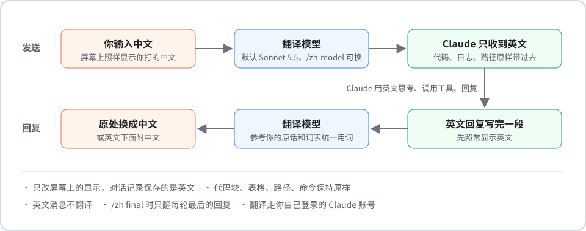

<div align="center">

# Claude Code 中文翻译

**简体中文** · [English](README.en.md)

在原生 `claude` 命令行里直接用中文：你的中文只以英文发给 Claude，回复在原处显示成中文。


</div>

## 功能

- **只发英文**：你打的中文由翻译模型译成英文，只把英文发给 Claude。你那一行照样显示你打的中文，下面以 ↳ 开头的一行是实际发出去的英文。
- **回复变中文**：Claude 用英文回复，每段写完就在后台翻译，译好后在原处变成中文；也可以设成英文下面附中文。
- **问答框也翻译**：Claude 用问答框问你问题时，问题和选项显示成中文；你选的选项和自己打的字以英文交给 Claude。问答框会先等几秒翻译再弹出，等的时候会提示“正在把问答框译成中文…”。
- **原样保留**：代码块、表格、路径和命令保持原样。
- **英文照常**：英文提问不受影响，照常发送，回复也不翻译。只发截图或粘贴内容、自己没打字，或者只回了 OK、yes 这样一两个英文词时，沿用上一条消息的语言。
- **菜单设置**：`/zh` 打开设置菜单，`/zh-model` 选翻译模型，改了立即生效。
- **统一用词**：可以用词表统一用词；翻译回复时也会参考你自己的原话。
- **费用可见**：每条翻译的费用和本会话累计都能看到，也可以显示在状态栏；不想看到金额可以在 `/zh` 里关掉。
- **也能用外部 API**：翻译可以改用 DeepSeek、通义千问、Kimi 等外部 API，或 Anthropic API，不占你的 Claude 额度；外部 API 出错时，那一段自动改用 Claude 账号翻译。

## 工作原理



这是一个 Claude Code 插件，装在 `~/.claude/skills/zh-translate`，Claude Code 启动时会自动加载。

## 要求

- **Claude Code 2.1.287 或更新**：用 `claude --version` 查看，`claude update` 升级。插件用的是 Claude Code 新的插件接口，更老的版本加载不了。
- **Node.js 18 或更新**：用 `node --version` 查看。
- **已登录 Claude Code**：翻译默认用你自己的账号，会计入你的用量或额度；改用外部 API 后就不占了。

## 安装

1. 下载：点这个页面上的 **Code → Download ZIP**，或者 `git clone` 本仓库，然后解压到任意位置。
2. 运行安装脚本：
   - Windows：双击 `install.cmd`；或者在解压目录打开终端，运行 `node install.mjs`。
   - macOS / Linux：在解压目录运行 `node install.mjs`。
3. 重新打开 `claude`。已经开着的话，也可以输入 `/reload-plugins` 让插件立即生效。

重复运行安装脚本是安全的，可以用来升级。你的模式、范围、模型和词表都会保留。

如果以前装过旧版（用 settings.json 里 hook 实现的那一版），安装脚本会先备份，再去掉旧版的 hook 和 `/zh`、`/zh-model` 命令。

## 用法

直接用中文提问即可。设置用 `/zh`：


| 命令 | 作用 |
|---|---|
| `/zh` | 打开设置菜单：开关、回复怎么显示、翻译哪些回复、是否显示翻译费用、翻译模型。上下键或 Tab 选择，回车切换，Esc 关闭 |
| `/zh on` / `/zh off` | 开启 / 关闭翻译 |
| `/zh only` | 回复只显示中文（默认） |
| `/zh both` | 英文回复下面附上中文 |
| `/zh all` | 每条回复都翻译（默认） |
| `/zh final` | 只翻译每轮最后的回复，Claude 中间的工作过程保持英文；你的消息照常翻译 |
| `/zh cost on` / `/zh cost off` | 显示 / 不显示翻译费用。关掉后回复下面、菜单和状态栏都不再显示金额 |
| `/zh-model` | 弹出列表，选择翻译用的模型，回车确认，Esc 取消 |
| `/zh model <模型 ID>` | 不用菜单直接换模型，例如 `/zh model claude-haiku-4-5` |
| `/zh api` | 打开外部 API 设置：选格式、填地址和密钥、选模型 |
| `/zh api off` | 改回用 Claude 账号翻译 |

几点说明：

- **设置立即生效**：比如从 `only` 改成 `both`，屏幕上已经有的回复会马上重画。设置对所有窗口生效，在一个窗口里改了，其他开着的窗口 2 秒内跟着变。Claude 正在回复时也可以打开菜单。
- **不花钱**：这些命令由插件自己处理，不会发给 Claude。
- **翻译中的回复**：先显示英文并标注“翻译中…”，译好后换成中文。

### 词表

`~/.claude/zh-translate/glossary.txt`，每行写一条 `中文 = English`，两个方向的翻译都会按它统一用词。想让某个词保持中文不翻，就写成 `词 = 词`。改完后下一次翻译就生效。

### 外部 API（可选）

翻译可以不用 Claude 账号，改用外部 API。支持 OpenAI 兼容的接口（DeepSeek、通义千问、Kimi、智谱、OpenRouter、本地 Ollama 等）和 Anthropic API。

1. 输入 `/zh api`，或在 `/zh` 菜单里选“外部 API…”。
2. 选接口格式，确认地址（DeepSeek 是 `https://api.deepseek.com`；很多服务的地址带 `/v1`，照服务文档填），粘贴密钥后回车。
3. 插件会自动获取模型列表。选一个模型，插件会先试译一个词，能用才换上。

之后 `/zh-model` 会同时列出 Claude 的模型和外部 API 的模型，随时可以切换；`/zh api off` 改回 Claude 账号。

几点说明：

- **隐私**：要翻译的内容（你的消息、Claude 的回复，里面可能有代码、服务器地址、密码）会发给这个服务。
- **密钥**：存在 `~/.claude/zh-translate/api-key`，菜单里只显示头尾（如 `sk-…00a3`）。请在菜单里填，不要写在消息或命令里，那样会存进对话记录。卸载时一起删除。
- **出错时**：外部 API 出错（网络、余额、密钥）时，那一段自动改用 Claude 账号翻译，并提示原因；一分钟内最多提示一次。
- **DeepSeek**：插件让它少想一点（`effort: low`），一段回复约 1.5 秒。DeepSeek-V4.1-Flash 按高峰价算，每段约 $0.0004，比 Sonnet 便宜七八倍。其他服务的模型算不出价格时显示“价格未知”。

### 状态栏（可选）

如果你用 [ccstatusline](https://github.com/sirmalloc/ccstatusline)，可以加一个“自定义命令”组件，显示类似 `译: Sonnet 5.5 $0.012` 的内容（这个窗口真正在用的翻译模型，和本会话的翻译费用；关掉显示费用后只显示模型）。要填的命令在安装结束时会打印出来，格式是：

```
"<node 路径>" "<家目录>/.claude/zh-translate/status.mjs"
```

## 速度和费用

费用按各模型的 API 价格，用实际用掉的 token 估算。用订阅账号时，消耗的是订阅额度。

| 模型 | 速度 | 译文 |
|---|---|---|
| Haiku 4.5 | 最快，约 2 秒一段 | 偏直译，偶尔翻错专有名词 |
| Sonnet 5.5（默认） | 快，约 3 秒一段 | 自然 |
| Opus | 较慢 | 自然 |
| Fable | 最慢、最贵 | 自然 |
| DeepSeek-V4.1-Flash（外部 API） | 很快，约 1.5 秒一段 | 自然，最便宜 |

`/zh-model` 的列表里有每个版本按一段回复估算的价格。翻译一条普通回复一般在 $0.002–0.02 之间，远低于 Claude 本身回复的费用。

## 限制

- **对话记录保存的是英文**：你的消息和 Claude 的回复都以英文保存，屏幕上的中文只是显示。译好的内容另存在 `~/.claude/zh-translate/cache.json`（最近 5000 条回复、2000 条你的消息，一轮结束时写一次），所有窗口共用：对话太长续开之后往回翻还是中文，同一段也不会翻两遍。
- **这些内容保持英文**：工具调用、思考过程、权限确认框。屏幕上的思考摘要（看着像普通的一行字）由 Claude Code 直接显示，插件改不了，所以是英文；不想看到可以在 `~/.claude/settings.json` 里设 `"showThinkingSummaries": false`，改成折叠显示。
- **问答框里某一题没译成**（出错或超过 20 秒）：那一题以英文显示，其他题照样是中文；你的回答照样译成英文交给 Claude。
- **`claude -p` 脚本模式**：没有界面，`/zh` 和 `/zh-model` 只回文字。`all` 范围下最后一段回复的翻译，可能在程序退出时来不及完成。

## 更新记录

- **0.5.3**：修复在同一个窗口里 `/clear` 或 `/resume` 换对话之后，插件的设置变回默认、译文变空的问题：关掉的翻译自己又打开、翻译模型变回 Sonnet、费用显示自己打开、重新打开的对话全是英文，都是它造成的。另外，选“回复怎么显示”“翻译哪些回复”（以及 `/zh only | both | all | final`）不再顺带把翻译打开，开关只有“开启 / 关闭”能动。
- **0.5.2**：译文留得更久（500 条只够两三个小时，隔天打开那个对话就全是英文了；现在留 5000 条，而且大文件一轮只写一次）；修复设置文件被别的窗口写到一半时读不出来、这个窗口会退回默认设置的问题——翻译模型莫名其妙变回 Sonnet、费用显示自己打开，都是它造成的。
- **0.5.1**：译好的内容改存在所有窗口共用的一个文件里（对话续开后往回翻还是中文，同一段不会翻两遍）；费用那一行和没译成的说明里写明真正出力的模型（外部 API 出错时会写“（备用）”）；状态栏显示这个窗口真正在用的模型，不再出现设置已改成外部 API、但这个窗口还没重载插件时状态栏谎报的情况。
- **0.5.0**：翻译可以改用外部 API：DeepSeek、通义千问、Kimi 等 OpenAI 兼容的接口，或 Anthropic API。`/zh api` 填地址和密钥，自动获取模型列表；`/zh-model` 同时列出 Claude 和外部 API 的模型；外部 API 出错时那一段改用 Claude 账号；状态栏显示外部模型的名字。
- **0.4.1**：问答框一题一个请求、同时翻译，4 题的问答框从 8 秒多缩短到 4 秒左右；不再 6 秒后改用英文弹出，而是等译好再弹出（每题最多等 20 秒），等的时候有提示；某一题没译成只影响那一题。修复只发截图（没有文字）或只回 OK、yes 这样一两个英文词时被当成英文、回复不翻译：现在沿用上一条消息的语言。测试适配 Claude Code 2.1.292。
- **0.4.0**：问答框也翻译：Claude 用问答框提问时，问题和选项显示成中文；你选的选项换回原来的英文、自己打的中文译成英文，再交给 Claude；回答那一行显示中文。
- **0.3.1**：Claude 回复中途输入 `/zh`、`/zh-model` 也会立刻弹出菜单，不用等这一轮结束；设置对所有开着的窗口生效（以前在一个窗口里关掉费用显示，其他窗口不变）；翻译没成功时用中文说明原因，不再只显示 `empty-reply` 这样的代码；修复回复一直显示“翻译中…”：插件重载（比如升级）时还没译完的回复，以前会一直卡住，现在会重新翻译。
- **0.3.0**：可以设置是否显示翻译费用（`/zh` 菜单里的“显示翻译费用”，或 `/zh cost on` / `/zh cost off`）。
- **0.2.0**：改成 Claude Code 插件：你的中文只以英文发给 Claude；回复在原处显示成中文；`/zh` 设置菜单和 `/zh-model` 模型列表。

## 卸载

Windows 双击 `uninstall.cmd`，其他系统运行 `node uninstall.mjs`。卸载会删除：

- 插件；
- 设置和词表；
- 临时文件；
- 旧版留下的 hook 和命令（如果有）。

如果在状态栏里加过翻译组件，需要手动删掉。

## 实现细节

- **发送前**：插件在 `prompt.submit` 把你的消息换成英文译文，再交给 Claude。
- **显示你的消息**：`UserMessage` 的绘制钩子把你那一行画成中文。
- **显示回复**：回复的每段存下时（`session.append`）在后台翻译，`AssistantMessage` 的绘制钩子把它画成中文。
- **只改显示**：屏幕上的中文只是显示，保存下来的对话是英文。
- **问答框**：问答框弹出前（`tool.call`）先把问题和选项译成中文（一题一个请求，同时发），问答框直接以中文弹出；你答完后，回答换成英文再交给 Claude，`ToolResult` 的绘制钩子把回答那一行画成中文。
- **外部 API**：OpenAI 兼容的接口发到 `/chat/completions`，Anthropic 的发到 `/v1/messages`（`$.http.fetch`）；模型列表来自 `/models`；模型列表说支持低档思考的（DeepSeek）带上 `effort: low`。
- **译文共享**：译好的内容按原文存在 `~/.claude/zh-translate/cache.json`，`session.start` 时读进来、`turn.complete` 时写回去；只属于单个会话的（问答框回答、翻译累计、在用的模型）还在 `%TEMP%/claude-zh/` 里。
- **隐私**：翻译默认走你自己登录的 Claude 账号（`$.model.complete`）；只有改用外部 API 时，才发给你填的那个服务。
- **测试**：插件自带测试，可以用 `claude plugin test ~/.claude/skills/zh-translate` 运行。

本文的图片是示意图，内容根据插件的实际输出绘制。
